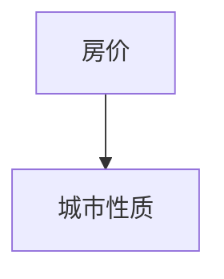

# 长沙

::: tip
长沙与作者：
其实最早我是没怎么听说过长沙的，要说记忆的话，有一次和朋友吃饭，一次偶然的机会，她说到长沙的房价很低，那已经是很久很久之前的事情了。我起初不以为然。我在打算写这个项目的时候，也没有打算好好研究长沙，后来我看了很多份政府的文件，当然还是房价这座大山，后来发现，我们前文说的那么多因素与条件其实都和大多数人没有关系，他们只想陪在父母身边，离不开故土。对家乡的土地爱的深沉，换句话说，大多数人没得选择，与其说选择城市，倒不如说城市选择自己
:::

## 房价

说长沙的话我最初也是拿房价来看的，主要参考了`贝壳找房`的数据，其实长沙也有其他比较有意思的地方，维度那么多，总得有个先后顺序，那就先`房价吧`

把房价的高地搞明白，就要依赖大量的数据，数据从哪里来呢，最早的时候我是在[贝壳找房-长沙-新房](https://cs.fang.ke.com/loupan/) （专业的平台做专业的事）既然说房价，就要产出内容

- 第一个输出，统计全长沙所有**在售住宅楼盘**的价格
- 第二个输出，能够动态分析每个板块、片区的最高价格和最低价格
- 第三个输出，尽可能把拿到的数据可视化

思路是找出一个房源，，然后进行字段分析，摘出来几个关键的字段 `小区的名字` `价格`

| 旧字段        |    新字段    |       含义 |
| ------------- | :----------: | ---------: |
| title         |     name     | 小区的名称 |
| average_price | averagePrice | 小区的均价 |

<IndexComp />

## 城市性质 <Badge type="warning" text="写作中" />

可能其他城市我需要先说城市性质了，不过长沙这座城市成为吸引力 TOP 榜单的一个核心竞争力就是房子的价格。所以上文先分析房价，让大家心里有个谱。
城市性质可以分为 `民间的` 和 `官方的`
在最早的时候，我整理了这几个关键词 （我起初是叫这些为城市的 IP）

> 长、省辖地级市、湖南省会、星城、特大城市、地区中心城市、长株潭城市群、2017 万亿（中部第 2 个）

后来随着我研究的深入，发现在一个地方可以很直观的看到较为官方的城市性质定义，那就是《国土空间总体规划》 [--->了解什么是国土空间规划](../guide/proper-noun.md)

- [长沙：《长沙市国土空间总体规划（2021-2035 年）》听证会召开](https://zrzyt.hunan.gov.cn/zrzyt/xxgk/gzdt/sxxx/202211/t20221122_29134160.html)

- [长沙：《长沙市国土空间总体规划（2021-2035 年）》公示](http://zrzyt.hunan.gov.cn/zrzyt/xxgk/gzdt/sxxx/202112/t20211228_21325543.html)

|                         |                                                     |                                                                                                              |
| ----------------------- | :-------------------------------------------------: | -----------------------------------------------------------------------------------------------------------: |
| 相关单位                |               长沙市自然资源和规划局                |                                                                                 http://zygh.changsha.gov.cn/ |
| 公示版本                | 《长沙市国土空间总体规划 （2021-2035 年 公示版） 》 |                                                                                                              |
| 发布时间                |                   2021 年 12 月份                   |                                                                                               一般为期一个月 |
| 公示时间                |       2021 年 12 月 23 日—2022 年 1 月 23 日        |                                                                                                              |
| 听证会召开              |                   11 月 18 日上午                   |                                                                                                              |
| Xi 大大考察湖南重要指示 |                    2020 年 9 月                     | 国家重要先进制作业、科技创新、内陆地区改革开放高地、高质量发展闯新路、推动中部绝对、长江经济带发展中显新担当 |
| 规划期限                |                  2021 年到 2035 年                  |                                                                                             三高四新、强省会 |
| 发展远景                |                                                     |                                                                           国际智造创新名城、美丽幸福山水洲城 |
| **城市性质**            |                                                     |      湖南省省会、国家重要先进制造业中心、中部地区 高质量发展和都市圈建设的示范城市、长江中游城市群核心增长级 |
| **发展目标**            |                       2025 年                       |                                                                                                 城市能级增强 |
| **发展目标**            |                       2035 年                       |                                                         长江经济带核心增长极、跻身国家中心城市 （1550 万人） |

### 总结

我最早也是听说长沙的**房价很低**。但是“知其然不知其所以然”。现如今人们提到长沙，部分人会冠“网红”以名。不过长沙这座城市成为吸引力 **榜单 TOP**的一个其中核心竞争力就是房子的价格。在最早的时候，我整理了这几个关键词 （我起初是叫这些关键词为城市的 IP）,分为：长、省辖地级市、湖南省会、星城、特大城市、地区中心城市、长株潭城市群、万亿 GDP。
后来随着我研究的深入，发现在一个地方可以很直观的看到较为官方的城市性质定义，那就是《GUOTU 空间总体规划》。未来的长沙：国家重要先进制作业、科技创新、内陆地区改革开放高地、高质量发展闯新路、推动中部崛起、长江经济带发展中显新担当。从规划的一部分内容来看，不难发现，长沙是一个`省会城市` ，有望成为 `国家中心城市`。2035 年预测全市常住人口规模为 `1550万人左右`

## 长沙行政辖区

> 6 个市辖市 + 1 个县 + 2 个县级市

| name          | 楼盘数量（贝壳） |
| ------------- | ---------------- |
| 市辖区 芙蓉区 |                  |
| 市辖区 天心区 |                  |
| 市辖区 岳麓区 |                  |
| 市辖区 开福区 |                  |
| 市辖区 望城区 |                  |
| 市辖区 雨花区 |                  |
| 县级市 浏阳市 |                  |
| 县级市 宁乡市 |                  |
| 县 长沙县     |                  |

## 高中教育 <Badge type="warning" text="写作中" />

> 这块我当时看到了 中国名校校长发展论坛 这也是数据的来源

有时候思考问题要秉承`从未来往现在的原则` 倘若在你的孩子 16 17 18 岁，且不说你在过着什么样的生活，那么你的孩子差不多在读着高中，马上就要高考。长沙中考 4000/5 万 6 **排名来源互联网、仅供参考 不代表作者观点**

- 湖南的高中： 长郡中学、雅礼中学、长沙市一中、师大附中、 桃源一中 石门一中、 明德中学 株洲二中 湘潭县一中 南雅中学
- 长沙高中 （四大名校）长郡中学、雅礼中学、长沙市一中、湖南师大附中
- 长沙高中 （五小名校）南雅中学、麓山国际实验学校、周南中学、明德中学、长沙市实验中学

## 互联网公司 <Badge type="warning" text="写作中" />

- 芒果 TV
- 兴盛优选 互联网电商
- **拓维信息**
- 水羊股份
- 御泥坊
- 问卷星 - 长沙冉星信息科技有限公司
- 竞网智赢
- 映客直播
- 快乐购
- 58 到家
- 长沙蜜罐信息
- 福米科技 互联网金融
- 云猴电商
- 好豆网
- 中清龙图
- 红网
- 芒果互娱
- 腾讯大湘网
- 荔枝 FM
- 亚信集团
- 深信服
- 中科睿芯
- 来也科技
- 源亭科技
- 万兴科技
- 浩鲸

## 买房实操

### 负面信息的小区

> 这块的统计主要来自 单位：局物业监管处、市房屋交易管理中心、局房地产市场监管处

- 合能枫丹
- 长沙梅溪湖金茂湾
- 长沙融创城
- 金茂建发观悦
- 新力铂园停工 8 个月复工无期
- 开福区悦湖商业广场开发进度
- 长沙万科魅力之城
- 岳麓区汉唐世家二期停工问题
- 大唐印象三期精装房洗手间漏水
- 岳麓区蔷薇国际强制交房
- 梅溪湖二期中海麓山镜教育用地不落实

## 落户

0、前提条件：手机 + 网络 + 已经毕业的你

（1）你需要有一部手机用来下载——我的长沙 APP

（2）你得有网络，不然打不开应用商店

（3）你得是个人 最好有证明你是个人才的材料

1、线上操作：应用商店下载我的长沙 APP，在 APP 上操作

（1）首页最上边有个搜索框，用手指点击搜索框输入：“户口服务”会跳转到“户政”分为：户口等级、户口迁入登记、户口证明申领等等。要知道我们是落户到长沙，所以我们对于长沙来说是迁入，手指滑到户口迁入登记，然后点击，自贸区人才引进落户

（2）点击后，APP 会有一个弹窗，此时不要怕，点击“我知道了”。ok 进入页面，请花时间看一下温馨提示，a.流程中的快递费需要你自己承担 b. 工作日和非工作日都能申请，按照申请的早晚进行依次审核 c.你的信息要真实等等

（3）同意，开始申请：一个底部弹窗让我们选择区域。这里科普一下，弹窗里边的选项是长沙当前的行政区县市，这里建议选择岳麓区，不要问问啥，问就是都一样，真的都一样。

（4）接着需要实名认证，验证你的脸部，眨眨眼啥的

（5）问：是否为机关事业单位在编人员 答：否

​ 问：您是否巴拉巴拉 答：否

（6）选择：学信网毕业证在线验证码（国内学历）（根据你的实际情况）

​ 落户方式：落人才机构集体户口

​ 人才机构名称：岳麓区政务服务中心

​ 证件领取方式：邮寄在线支付

​ 填写你的收件地址 （注意注意注意请看下边的补充）

​ 工作单位：可以不填写

补充：

（1）自贸区人才引进落户，是我个人觉得最方便快捷的方式

（2）上文落户的目的地区，没什么区别，都是集体户口

（3）家里有地，牵扯到分配房产、拆迁等等还是自习斟酌一下、和父母亲友确认好自己到底是否需要继承家产

（4）费用问题：整个流程除了快递费和迁入代办一毛钱没花

（5）注意一些公职人员 或者机关单位的人员貌似不可以申请自贸区人才引进落户，不要问为什么，政策就是这么说的

（6）注意：你要是自己不去拿材料，快递的话，请直接快递到你的老家，就是你的老家啊，老家，不要问为什么，问就是你不方便回老家可能

1、书接上回，系列 1 的操作中说复杂的话，那就是学历认证，目前长沙市 本科生和专科生都可以
（1）你要登录学信网，用电脑就行 网址 https://www.chsi.com.cn/xlcx/index.jsp
（2）点击学历查询 ，看一下自己的学籍档案 ，右上角有一个 查看该学历的电子注册备案表
（3）备案表中，有一个在线验证的在线验证码，然后把这个验证码填上去，用于申请的过程中校验你的学历是否真实
2、现在开始在我的长沙 APP 我的界面 往下滑有个其他中的我的办事，当你成功申请之后会有一个进度
（1）从你提交申请的到通过用不了多久，会给你信息告知你流程
（2）接着你要做的就是等着快递吧，系列 1 中说过请直接快递到你老家
3、现在要做的事情就是把你身边的身份证原件用手机拍一下照片，不要问为什么，因为做核酸的时候用，接着就是把你的身份证一起快递到老家
（1）老家管户籍的派出所他们都懂，你只需要让家人 父母或者朋友待办理一下，注意这个过程可以不用本人理论上，但是为了确保最好先问一下

4、老家派出所需要：
（1）你的身份证原件:你已经快递过去并且和申请的材料一同在快递的路上
（2）长沙市发出的材料文件:用于你老家办理迁出

5、补充
（1）这里说一下把户口迁入长沙的整体流程：
a.由你在我的长沙 APP 发起线上申请
b.长沙相关工作人员按照顺序审核校验你是否满足长沙自贸区人才引进政策
c.长沙发起户口迁出的材料邮寄（邮寄你老家，因为你的地址写的是你老家）
d.老家派出所办理迁出
e.长沙办理迁入，具体流程会尽快整理 教程 3
（2）注意:湖南省省内户口迁入长沙可能可以全部线上操作，不用线下，这里分享的是省外的情况，大体流程差不多 不管省内和省外全部流程下来可以不用去长沙本地，不会影响工作
（3）注意注意注意：整个流程是有办理周期的，大致 40 天的样子，说人话就是文件材料是有有效期的，请在有效期内走完整个流程

<!-- ## 高中教育

## 买房购房

### 长沙开发商

### 资格

- 【先下审核周期】身份证复印件及进三十个月的个税明细清单 雨花网点联系电话 84662152

### 板块

【第一梯队】

- 市中心滨江
- 梅溪湖
- 洋湖
- 市府
- 高铁南

### 待选小区

- 长沙北中心时代 1 号线
- 长沙如院

  - 2 号西延长
  - 长沙西近
  - 

- 天健云麓府
- 汉唐世家
- 百世云镜
- 阳光城 翡丽云邸
- 中海麓山镜
- 长房悦香山
- 轨道万科悦府

## 长沙十四五

关键词：三高四新 岳麓山（科创） 马栏山（文创）、岳麓山大学科技城、马栏山视频文创产业园、加快推进地铁 6 号线、1 号线北延一期、2 号线西延二期等工程建设，启动 4 号线北延、5 号线南延和北延、7 号线一期、磁浮快线东延、长沙软件园进入全国软件园前十强，争创中国软件名城

## 长沙市住房和城乡建设局

### 正常

- **麓谷山湖郡**

## 行政区划

### 芙蓉区

### 天心区

### 岳麓区

### 开福区

### 望城区

### 雨花

## 长沙轨道交通十四五

## 政务单位

- 局物业监管处
- -->
