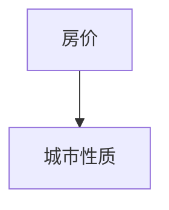

# 长沙

::: tip
长沙与作者：
其实最早我是没怎么听说过长沙的，要说记忆的话，有一次和朋友吃饭，一次偶然的机会，她说到长沙的房价很低，那已经是很久很久之前的事情了。我起初不以为然。我在打算写这个项目的时候，也没有打算好好研究长沙，后来我看了很多份政府的文件，当然还是房价这座大山，后来发现，我们前文说的那么多因素与条件其实都和大多数人没有关系，他们只想陪在父母身边，离不开故土。对家乡的土地爱的深沉，换句话说，大多数人没得选择，与其说选择城市，倒不如说城市选择自己
:::

## 房价

说长沙的话我最初也是拿房价来看的，主要参考了`贝壳找房`的数据，其实长沙也有其他比较有意思的地方，维度那么多，总得有个先后顺序，那就先`房价吧`

依赖数据，把房价搞明白，既然说房价，就要产出内容

- 第一个输出，统计全长沙所有在售楼盘的价格
- 第二个输出，能够动态分析每个板块、片区的最高价格和最低价格
- 第三个输出，尽可能使用`Mock` 技术，异步加载数据，并能够可视化

- [贝壳找房-长沙-新房](https://cs.fang.ke.com/loupan/)

思路是找出一个房源，，然后进行字段分析，摘出来几个关键的字段 `小区的名字` `价格`
<IndexComp />

## 城市性质 <Badge type="warning" text="写作中" />

可能其他城市我需要先说城市性质了，不过长沙这座城市成为吸引力 TOP 榜单的一个核心竞争力就是房子的价格。所以上文先分析房价，让大家心里有个谱。
城市性质可以分为 `民间的` 和 `官方的`
在最早的时候，我整理了这几个关键词 （我起初是叫这些为城市的 IP）

> 长、省辖地级市、湖南省会、星城、特大城市、地区中心城市、长株潭城市群、2017 万亿（中部第 2 个）

后来随着我研究的深入，发现在一个地方可以很直观的看到较为官方的城市性质定义，未完待续……

## 高中教育 <Badge type="warning" text="写作中" />

> 这块我当时看到了 中国名校校长发展论坛 这也是数据的来源

有时候思考问题要秉承`从未来往现在的原则` 倘若在你的孩子 16 17 18 岁，且不说你在过着什么样的生活，那么你的孩子差不多在读着高中，马上就要高考。长沙中考 4000/5 万 6 **排名来源互联网、仅供参考 不代表作者观点**

- 湖南的高中： 长郡中学、雅礼中学、长沙市一中、师大附中、 桃源一中 石门一中、 明德中学 株洲二中 湘潭县一中 南雅中学
- 长沙高中 （四大名校）长郡中学、雅礼中学、长沙市一中、湖南师大附中
- 长沙高中 （五小名校）南雅中学、麓山国际实验学校、周南中学、明德中学、长沙市实验中学

## 互联网公司 <Badge type="warning" text="写作中" />

- 芒果 TV
- 兴盛优选 互联网电商
- **拓维信息**
- 水羊股份
- 御泥坊
- 问卷星 - 长沙冉星信息科技有限公司
- 竞网智赢
- 映客直播
- 快乐购
- 58 到家
- 长沙蜜罐信息
- 福米科技 互联网金融
- 云猴电商
- 好豆网
- 中清龙图
- 红网
- 芒果互娱
- 腾讯大湘网
- 荔枝 FM
- 亚信集团
- 深信服
- 中科睿芯
- 来也科技
- 源亭科技
- 万兴科技
- 浩鲸

## 买房实操

### 负面信息的小区

> 这块的统计主要来自 单位：局物业监管处、市房屋交易管理中心、局房地产市场监管处

- 合能枫丹
- 长沙梅溪湖金茂湾
- 长沙融创城
- 金茂建发观悦
- 新力铂园停工 8 个月复工无期
- 开福区悦湖商业广场开发进度
- 长沙万科魅力之城
- 岳麓区汉唐世家二期停工问题
- 大唐印象三期精装房洗手间漏水
- 岳麓区蔷薇国际强制交房
- 梅溪湖二期中海麓山镜教育用地不落实

<!-- ## 高中教育

## 买房购房

### 长沙开发商

### 资格

- 【先下审核周期】身份证复印件及进三十个月的个税明细清单 雨花网点联系电话 84662152

### 板块

【第一梯队】

- 市中心滨江
- 梅溪湖
- 洋湖
- 市府
- 高铁南

### 待选小区

- 长沙北中心时代 1 号线
- 长沙如院

  - 2 号西延长
  - 长沙西近
  - 

- 天健云麓府
- 汉唐世家
- 百世云镜
- 阳光城 翡丽云邸
- 中海麓山镜
- 长房悦香山
- 轨道万科悦府

## 长沙十四五

关键词：三高四新 岳麓山（科创） 马栏山（文创）、岳麓山大学科技城、马栏山视频文创产业园、加快推进地铁 6 号线、1 号线北延一期、2 号线西延二期等工程建设，启动 4 号线北延、5 号线南延和北延、7 号线一期、磁浮快线东延、长沙软件园进入全国软件园前十强，争创中国软件名城

## 长沙市住房和城乡建设局

### 正常

- **麓谷山湖郡**

## 行政区划

> 6 个市辖市 + 1 个县 + 2 个县级市
>
> 湘江新区

| name          | 楼盘数量（贝壳） |
| ------------- | ---------------- |
| 市辖区 芙蓉区 |                  |
| 市辖区 天心区 |                  |
| 市辖区 岳麓区 |                  |
| 市辖区 开福区 |                  |
| 市辖区 望城区 |                  |
| 市辖区 雨花区 |                  |
| 县级市 浏阳市 |                  |
| 县级市 宁乡市 |                  |
| 县 长沙县     |                  |

### 芙蓉区

### 天心区

### 岳麓区

### 开福区

### 望城区

### 雨花

## 长沙轨道交通十四五

## 政务单位

- 局物业监管处
- -->
